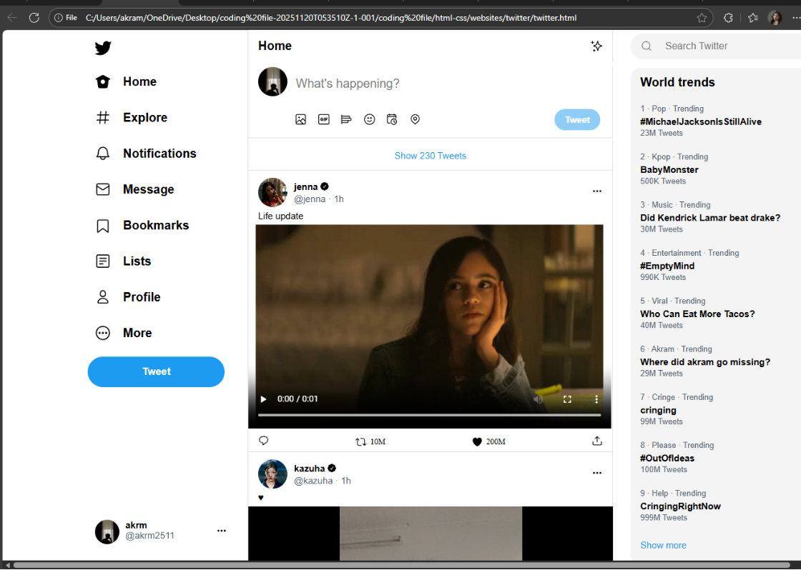

# Twitter Clone

A responsive front-end clone of the Twitter (X) user interface built using HTML and CSS. This project was created to improve my understanding of responsive layouts, social media platform design, and modern front-end development practices.

## Preview



## Features

- Responsive Twitter-inspired interface
- Navigation sidebar
- Timeline feed layout
- User profile section
- Trending topics section
- Modern social media UI design

## Technologies Used

- HTML5
- CSS3

## Project Structure

```text
twitter-clone/
│
├── index.html
├── css/
│   └── style.css
├── images/
├── screenshots/
└── README.md
```

## Learning Outcomes

Through this project, I learned:

- Responsive web design principles
- CSS Flexbox and Grid layouts
- User interface replication techniques
- Layout organization and component structuring
- Front-end development best practices

## Future Improvements

- Add JavaScript interactivity
- Implement tweet creation functionality
- Add dark/light mode toggle
- Connect with a backend service
- Rebuild using React.js

## Author

Akram Jha

Computer Science Graduate
